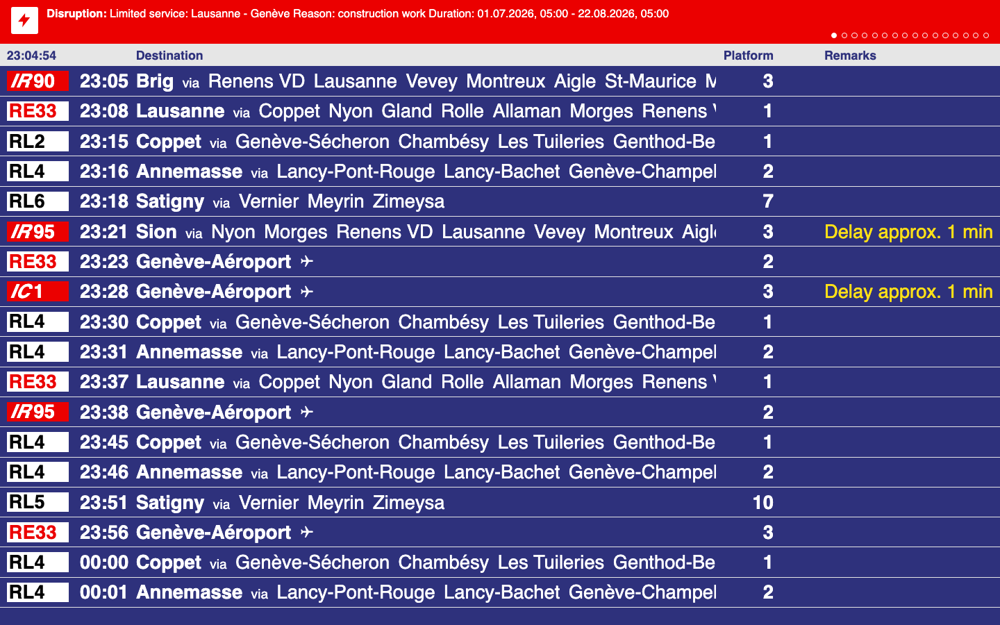

# sbb-display-board

A web-based replica of the modern Swiss (SBB/CFF/FFS) train station departure
board: the dark navy LED/LCD-style board you see at regional stations today,
not the classic split-flap one. Built with Vite, React, and TypeScript,
fetching live departure/arrival data directly from the public
[transport.opendata.ch](https://transport.opendata.ch) API.



## Status

Software UI only. It runs in any browser today; there's no hardware yet.
The eventual target is a small dedicated screen (Raspberry Pi + Chromium
kiosk mode) with three physical buttons, but that phase hasn't started.
See [docs/ROADMAP.md](docs/ROADMAP.md). The three "buttons" (cycle station,
toggle departures/arrivals, cycle language) are simulated today with keys
1/2/3 on your keyboard.

## Quickstart

```bash
npm install
npm run dev
```

Then open the printed local URL. The board starts empty, so go to
`/settings` to add a station by name (it autocompletes against the live
API), then head back to `/`.

### Disruption banner (optional)

The stationboard itself works with just `npm run dev` above. The red
disruption banner needs a second process: a small local proxy in front of
opentransportdata.swiss's SIRI-SX API, since that API needs a secret key
(see [docs/DATA.md](docs/DATA.md)):

```bash
npm run server
```

This reads `OTD_API_KEY_SIRI_SX` and `OTD_API_KEY_SIRI_SX_UNPLANNED` from
`.env` (two separate API products/keys, see docs/DATA.md for why) and
listens on port 8787, which `npm run dev` proxies `/api/*` to. Without it
running, the banner just never appears; nothing else breaks.

## Changing the default station

There's no env-var/config-file default. The board reads whatever's saved
in `/settings`, persisted to your browser's `localStorage`. To ship a
different default out of the box, edit `DEFAULT_STATE` in
[src/context/AppStateContext.tsx](src/context/AppStateContext.tsx) and add
a station to `savedStations`.

## Deployment

Production runs in a single Docker container on the author's home server
(port 8082, behind a Cloudflare Tunnel). Pushing to `main` triggers
[.github/workflows/deploy.yml](.github/workflows/deploy.yml), which joins
the tailnet via Tailscale and runs `docker compose up -d --build` on the
server over Tailscale SSH — no manual deploy steps.

To run the same container locally:

```bash
docker compose up --build
```

## Learn more

- [docs/ARCHITECTURE.md](docs/ARCHITECTURE.md): how the pieces fit together
- [docs/DATA.md](docs/DATA.md): the API endpoints in use, including the
  disruption feed's proxy design, and what's still mocked
- [docs/ROADMAP.md](docs/ROADMAP.md): what's deliberately deferred, and why

## License

No license file yet. Treat this as all-rights-reserved until one is added.
